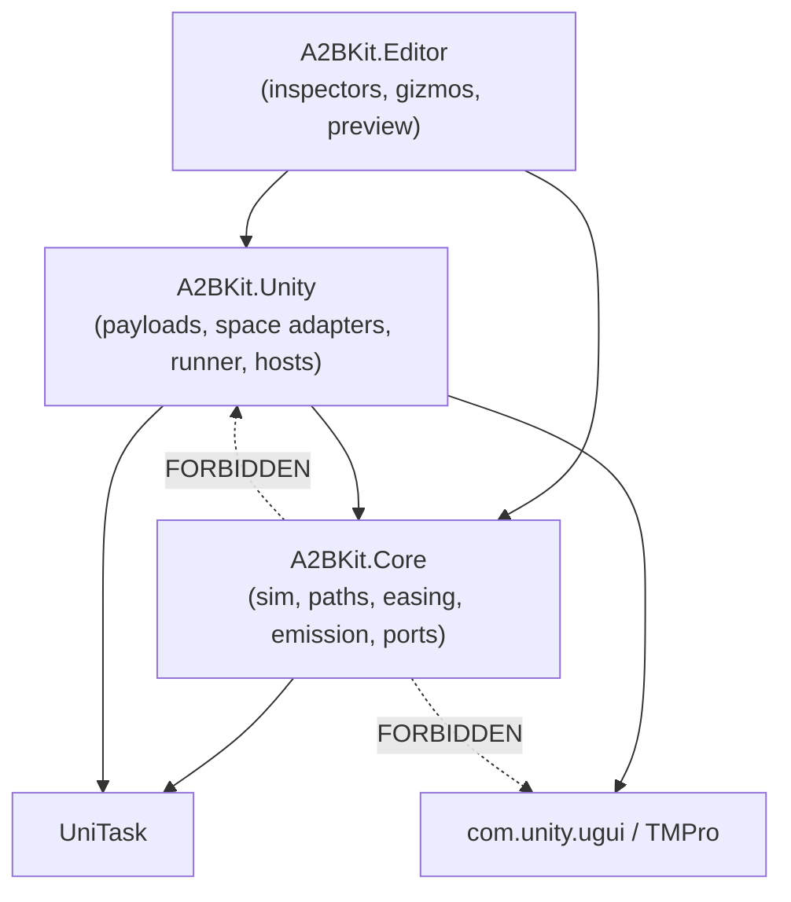
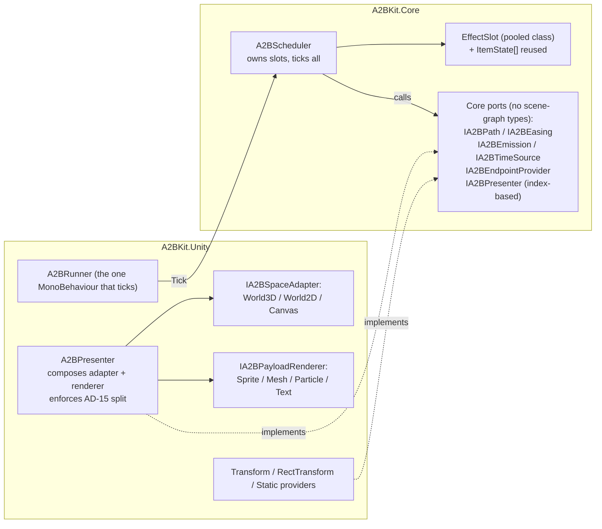

# Architecture Spine — A2BKit

## Design Paradigm

**Ports & Adapters (hexagonal) over a data-oriented core simulation.**

The core owns *when an item is and where it goes*: pure math over structs, driven by an injected clock. It knows nothing of GameObjects, Canvases, cameras, or TextMeshPro. Everything Unity — rendering a payload, converting a coordinate, reading a Transform — is an adapter behind a port.

This is not decoration. It is what makes NFR-4 (determinism) and every EditMode motion test possible: if `Vector3 Evaluate(t)` needed a scene, the test matrix in FR-18/FR-25 could not exist. The five extension interfaces from the PRD *are* the ports.

| Layer | Namespace | Assembly |
| --- | --- | --- |
| Core simulation + ports | `A2BKit.Core.*` | `A2BKit.Core` |
| Unity adapters + hosts | `A2BKit.Unity.*` | `A2BKit.Unity` |
| Editor tooling | `A2BKit.Editor.*` | `A2BKit.Editor` |

## Invariants & Rules



### AD-1 — Dependency direction is compiler-enforced by assembly, not by convention

- **Binds:** all
- **Prevents:** Unity types creeping into the simulation, which would silently make the core untestable without a scene and dissolve the paradigm one `using` at a time.
- **Rule:** `A2BKit.Core` must not reference `A2BKit.Unity`, `UnityEngine.UI`, `TMPro`, any `MonoBehaviour`/`ScriptableObject`-derived type, **or any scene-graph type (`Transform`, `GameObject`, `Camera`, `Canvas`, `RectTransform`)**. Its only permitted Unity surface is value math (`Vector2/3/4`, `Quaternion`, `Mathf`, `Color`, `AnimationCurve`). Dependencies flow `Editor → Unity → Core` and never back. Enforced by asmdef references, not review.
- **Consequence (resolves the AD-1 ↔ AD-15 collision):** because `Transform` is banned here, the presentation ports that *need* a Transform cannot live in Core. Core's only presentation port is the index-based `IA2BPresenter` (AD-18). `IA2BSpaceAdapter` and `IA2BPayloadRenderer` are **`A2BKit.Unity` interfaces**, composed behind that port. They remain open/closed extension points (FR-6, FR-8) — they simply live one layer out, which is where a type that touches the scene graph belongs.

### AD-2 — Strategy implementations are stateless classes; never structs behind an interface

- **Binds:** `IA2BPath`, `IA2BEasing`, `IA2BEmission`, `IA2BEndpointProvider`, `IA2BSpaceAdapter`, `IA2BTimeSource`, `IA2BPayloadRenderer`
- **Prevents:** The quietest possible violation of NFR-1 — a `struct` assigned to an interface-typed field boxes **once per assignment and again per virtual call**, allocating in the hot loop while the code still reads as zero-alloc. It would not be caught by review, only by the FR-18 test failing mysteriously.
- **Rule:** Any type stored in an interface-typed field is a `class`. Strategy instances are shared across effects and items — per-effect *runtime* data travels in the `in`-passed context struct, never in strategy fields. A strategy that mutates itself during a tick is a bug: it breaks FR-3's "concurrent plays share no mutable state".
- **Correction — "stateless" was the wrong word, and it licensed a real defect.** `IA2BPath`, `IA2BEasing` and `IA2BEmission` implementations *do* hold state: authored configuration (arc height, item count, scatter radius). They are **immutable after authoring**, not stateless. The original wording said stateless, `A2BEffectDefinition.Clone()` cited it to justify sharing strategies by reference, and `A2BEffectBuilder.From(asset).Stagger(…)` then wrote straight through into the source asset's emission — silently editing the asset on disk and every other effect using it, exactly inverting FR-2's promise. **Anything that changes a strategy's configuration must copy it first** (copy-on-write, as `A2BEffectBuilder.EnsureBurst` now does). `IA2BPayloadRenderer` is a further exception: it owns a pool and cannot be shared at all — see AD-14/AD-18's `CreateRuntimeInstance`.

### AD-3 — Per-frame allocation is zero, by construction

- **Binds:** NFR-1, FR-9, FR-11, FR-12, FR-14, FR-18, FR-26
- **Prevents:** Death by a thousand cuts — each individually-defensible convenience (a LINQ `Where`, a capturing lambda, a `params` array, a `foreach` over an interface-typed collection) is invisible alone and fatal in aggregate.
- **Rule:** In any code reachable from the per-frame tick: **no** LINQ, **no** closures or capturing lambdas, **no** `params` arrays, **no** `foreach` over an interface-typed or boxed enumerator (index `for` over concrete arrays/`List<T>`), **no** string concatenation or interpolation (including in log calls — guard with a level check), **no** boxing, **no** `ToString()` on value types. Collections are pre-sized and reused, never grown per frame. New code in the tick path ships with its FR-18 matrix entry passing, or it does not ship.
- **Enforcement API (pinned — the headline requirement must not rest on an unnamed mechanism):** `UnityEngine.TestTools.Constraints` — `Assert.That(() => { … }, Is.Not.AllocatingGCMemory())`, from the Test Framework already in the manifest. The Performance Testing package is **not** required. **Gotcha that must be encoded in every allocation test:** Unity's `Is` shadows NUnit's `Is`, so each such file requires `using Is = UnityEngine.TestTools.Constraints.Is;` (or the fully-qualified name) — otherwise the constraint silently resolves to NUnit's `Is` and **the test passes while measuring nothing**. A green allocation suite that asserts nothing is worse than no suite.

### AD-4 — All motion math runs in the effect's working space; adapters own every conversion

- **Binds:** FR-4, FR-5, FR-6, FR-28, NFR-3
- **Prevents:** Coordinate conversion smearing across payloads and paths — the failure that produces four separate half-correct `WorldToScreenPoint` call sites and the bugs catalogued in addendum §3.
- **Rule:** `IA2BEndpointProvider` resolves to a position **plus the coordinate domain it is in** (see AD-21 — this clause originally said "a world position", which is false for a UI target and broke the canonical coin-to-wallet path). `IA2BSpaceAdapter` is the *only* type permitted to call `Camera.WorldToScreenPoint`, `RectTransformUtility.*`, or otherwise convert between coordinate domains. Paths, payloads, emission, and the scheduler operate exclusively in working space and never learn which Space they are in. A conversion call site outside a Space Adapter is a defect regardless of correctness.

### AD-5 — The Canvas adapter encodes the four known gotchas as invariants

- **Binds:** FR-4, FR-5, NFR-3
- **Prevents:** Re-earning the exact bugs the package exists to eliminate — each is a documented Unity trap that reads as correct code.
- **Rule:** (a) Overlay canvases pass **`null`** as the camera to `RectTransformUtility.ScreenPointToLocalPointInRectangle`; Screen-Space-Camera passes `canvas.worldCamera`; World-Space canvases use neither path. (b) Every `WorldToScreenPoint` result is gated on `z > 0` before use; behind-camera endpoints resolve as invalid rather than as plausible on-screen coordinates. (c) Render mode is read from the live `Canvas`, never cached across frames or assumed from config. Each clause has a named test.

### AD-6 — One scheduler ticks every effect; nothing self-updates; the tick carries no delta

- **Binds:** FR-3, FR-16, NFR-4, FR-22
- **Prevents:** N `MonoBehaviour.Update()` callbacks (Unity's per-call interop overhead is the classic cause of "why is 200 of anything slow"), plus nondeterministic ordering that would make NFR-4 unreachable. The no-delta clause prevents a direct collision with AD-12: a single `Tick(dt)` cannot serve a paused-menu effect (unscaled) and a gameplay effect (scaled) in the same frame — FR-16's motivating case — so one of the two ADs would have had to be violated on the first real use.
- **Rule:** Exactly one driver calls `A2BScheduler.Tick()` once per frame, and **`Tick` takes no delta**. The scheduler pulls the delta from each slot's `IA2BTimeSource`, evaluating each *distinct source instance* at most once per tick and caching it — one tick, N deltas. No `Update`/`LateUpdate`/`Coroutine` exists on items, effects, payloads, or providers. Item order within an effect is stable and index-based across frames. Tests tick with an injected manual source rather than a hand-supplied delta.

### AD-7 — Effect Handle is a struct with a generation stamp; validity is checked on every access

- **Binds:** FR-27, FR-3, FR-15, NFR-3
- **Prevents:** The pooled-handle aliasing defect — a stale copy of a handle silently addressing a *different* effect that has since reused the slot, cancelling someone else's coins. Silent, intermittent, and near-impossible to diagnose in the field.
- **Rule:** `A2BEffectHandle` is a `readonly struct { int slot; uint generation; }`. The slot's generation increments on every release. **Every** handle operation resolves through a validity check comparing stamps; a mismatch makes the operation a no-op returning a safe default. No API accepts a raw slot index. A handle never owns disposal — copying it by value is safe by construction.

### AD-8 — Failure is logged, never thrown

- **Binds:** NFR-3, FR-3, FR-13, FR-23, FR-27
- **Prevents:** A cosmetic system taking down gameplay. A coin effect that throws into a reward-granting call stack can cost a player their purchase.
- **Rule:** No public A2BKit API throws for a runtime or configuration fault. Invalid config logs one actionable error naming the offending object and returns an invalid handle. Destroyed endpoints, exhausted pools, and subscriber exceptions degrade per policy. Subscriber callbacks are invoked inside a `try/catch` that logs and continues, so one bad listener cannot leak pooled items or suppress the rest of the event set. `OperationCanceledException` on the UniTask path is the sole exception, and only because it is the language's cancellation contract.

### AD-9 — Every terminal path returns items to the pool through one exit

- **Binds:** FR-17, FR-13, FR-14, NFR-1
- **Prevents:** Leaks on the paths nobody tests. Completion is exercised constantly; cancel-mid-flight, destroyed-destination, and subscriber-threw are exercised only by the bug report.
- **Rule:** Completion, cancellation, destroyed endpoint, invalid config, and subscriber exception all funnel through a single `ReleaseEffect(slot, reason)`. That method is the only place items are released, the only place the generation is bumped, and the only place `Completed`/`Cancelled` are raised — guaranteeing FR-14's "exactly one of Completed or Cancelled, never both, never neither" structurally rather than by discipline. Each reason has a test asserting pool occupancy returns to baseline.

### AD-10 — Emission variation is computed from (seed, index), never stored

- **Binds:** FR-26, NFR-1, NFR-4
- **Prevents:** The obvious implementation — build a `List<float>` of delays and a `List<Vector3>` of scatter offsets per play — which allocates per play *and scales with item count*, violating both halves of the §9.3 budget.
- **Rule:** Per-item delay, scatter offset, and any per-item variation are pure functions of `(effectSeed, itemIndex)` evaluated on demand via a struct xorshift RNG. No per-item collection is built at play time. Same seed ⇒ same layout, which is what makes scatter testable (NFR-4).

### AD-11 — Two event APIs, one of them honest about its cost

- **Binds:** FR-14, NFR-1, §9.1
- **Prevents:** Either shipping only a zero-alloc API too awkward to adopt (users write their own wrapper, badly), or shipping only C# events and quietly breaking the headline claim the first time someone passes a capturing lambda.
- **Rule:** `IA2BEffectListener` is the supported allocation-free path: the caller supplies one reusable implementer; dispatch is a plain interface call. C# events on the handle are the convenience path and are documented as costing **Per-Play** allocation when the subscriber captures. Both raise identical events in identical order — the async path never suppresses events, nor vice versa (FR-15). Event dispatch itself never allocates: no `params`, no delegate combination in the tick, no boxing of event args.

### AD-12 — Nothing in the tick path reads `Time.*`

- **Binds:** FR-16, NFR-4, FR-21
- **Prevents:** One stray `Time.deltaTime` making a test nondeterministic and the editor preview unbuildable — the same seam serves both, so the leak breaks two features at once.
- **Rule:** `IA2BTimeSource` is the only type permitted to read `UnityEngine.Time`. The scheduler receives a delta; it never fetches one. Scaled/unscaled is a time-source choice, not a branch in the sim. Editor preview and tests inject a manual time source — the identical seam, which is why preview and tests cannot drift from runtime behavior.

### AD-13 — Path evaluation is a pure function pinned at both ends

- **Binds:** FR-9, FR-10, FR-11
- **Prevents:** Paths that drift from their endpoints, which would make Arrival (and therefore `FirstItemArrived`, the package's reason to exist) meaningless.
- **Rule:** `Vector3 Evaluate(in A2BPathContext ctx, float t)` is pure — no frame state, no side effects, no allocation. **`Evaluate(ctx, 0) == ctx.Origin` and `Evaluate(ctx, 1) == ctx.Destination` within tolerance, for every path including user-authored ones.** This invariant is asserted by a shared conformance test any custom path can run. Easing reparameterizes `t` *before* `Evaluate`; a path that eases internally is a defect (it would double-apply and break composition, FR-11).
- **Arrival is `t >= 1`, and only `t >= 1`.** Not distance-to-destination. Because this rule already pins `Evaluate(ctx,1)` to the destination, a distance test is redundant — and with a moving destination (FR-12) or an overtaking scattered item (FR-26) the two definitions fire on different frames for different items, making FR-14's "genuine first Arrival" untestable. Two definitions of one event is one too many. `ItemArrived` is raised in the tick where `t` crosses 1, in index-ascending order within the frame.

### AD-14 — Canvas items are parented to a dedicated A2BKit canvas by default

- **Binds:** FR-28, NFR-2
- **Prevents:** Rebuild storms. Any drawable change re-runs batch building for **every** element on that Canvas; 200 moving items on the host HUD canvas makes the rebuild, not the motion, the frame spike — the addendum's #2 recurring failure.
- **Rule:** `Canvas` Space items parent to an A2BKit-owned canvas, not the destination's. Overridable, because batches do not merge across canvases and a team that has profiled the opposite trade must be able to opt out. The default trades a draw call for rebuild isolation.
- **Pool identity is `(PayloadKind, Definition, Space)`** — a pooled item never crosses Spaces. Without the Space term, a `Sprite` item used by a Canvas effect returns to the pool carrying a `RectTransform` under a Canvas and is then handed to a World3D effect. FR-17 says pools are per-Definition-and-Payload and is silent on Space; this closes that gap.
- **Parenting happens at exactly two call sites and nowhere else:** the pool's `actionOnGet` parents to the adapter's `Root` (AD-15), and `actionOnRelease` parents back to the pool root. A payload renderer that reparents is a defect (AD-15).

### AD-15 — The Space Adapter owns the item's Transform; payload renderers own only drawable properties

- **Binds:** FR-4, FR-5, FR-7, FR-8, FR-28
- **Prevents:** The spine's largest hole before review: AD-4 assigned *conversion* to the adapter, but nothing assigned the **return leg** — who actually writes the item's Transform. Two payload authors both obeying AD-4 (neither calls a conversion API) can still read the same visual state and write `transform.localPosition` vs `transform.position`, putting a Canvas-Space mesh effect at raw canvas coordinates near the world origin. Both implementations are conforming; one is wrong; nothing in the spine chose.
- **Rule:** `IA2BSpaceAdapter` (an `A2BKit.Unity` interface — see AD-1) exposes `Transform Root` and `void ApplyToTransform(Transform t, in A2BVisualState s)`, and is the **only** type that writes an item's position, rotation, scale, or parent. `IA2BPayloadRenderer` may touch **drawable properties only** — sprite, mesh, color, text content, material. A payload renderer that writes `transform.position`/`localPosition`/`parent`/`localScale` is a defect regardless of correctness. `A2BPresenter` (the `IA2BPresenter` implementation, AD-18) composes the two and calls `renderer.UpdateItem` then `adapter.ApplyToTransform`, in that order. Enforcing the split is `A2BPresenter`'s job, since Core cannot see either type.

### AD-16 — Emission emits unitless scatter; the adapter assigns units

- **Binds:** FR-26, FR-4, NFR-4
- **Prevents:** Scatter that means 50 px on a Canvas and 50 m in World3D from the same authored asset. AD-10 makes scatter a pure function and AD-4 forbids it from knowing its Space — so "radius = 50" has no defined meaning, and both readings (working-space offset vs. world offset scaled by perspective) are defensible. The FR-18 allocation matrix passes under both, so the bug ships.
- **Rule:** `IA2BEmission` returns a **unitless normalized** offset in `[-1,1]³`. The Space Adapter converts it (`Vector3 ScaleScatter(in Vector3 unit, float radius)`) and is the only type that assigns units. Scatter applies to the working-space origin **after** `ToWorkingSpace`, never before. Each adapter carries a named test asserting a unit offset maps to `radius` in its own domain.

### AD-17 — `Tick` is non-reentrant; the active-slot collection is never structurally mutated mid-tick

- **Binds:** FR-3, FR-14, NFR-1, NFR-4
- **Prevents:** A subscriber calling `Play()` from inside an `ItemArrived` callback — which is not exotic, it is the *documented* use case (start the counter roll-up, spawn a follow-up burst). AD-8 requires the callback be invoked and continue; nothing stopped it re-entering. Growing the slot list mid-`for` either allocates (violating AD-3) or invalidates the index loop and corrupts state. AD-6 also cannot say whether the new effect advances with a delta it did not exist for.
- **Rule:** Effects created during a tick enter a pending queue and receive their first advance on the **next** tick with a full delta. `ReleaseEffect` called during a tick defers slot reuse to the tick boundary (the generation still bumps immediately, so AD-7 invalidates stale handles at once). The active-slot collection is never structurally mutated between the loop's first and last index. Named test: an `ItemArrived` subscriber that plays a second effect.

### AD-18 — Core's only presentation port is index-based `IA2BPresenter`

- **Binds:** FR-4, FR-6, FR-7, FR-8, NFR-6, AD-1, AD-15
- **Prevents:** The AD-1 ↔ AD-15 contradiction that the epics pass surfaced: AD-15's port needs `Transform`, AD-1 bans scene-graph types from Core, and the spine located the port in Core. Left unresolved, the first implementer would have silently relaxed AD-1 — and Core's scene-free testability, the entire justification for the paradigm, would have leaked away one type at a time.
- **Rule:** Core drives presentation through exactly one port: `IA2BPresenter { int Acquire(in A2BItemSpawnInfo info); void Apply(int itemId, in A2BVisualState state); void Release(int itemId); }`. It speaks in **item ids and value structs — never Transforms**. `A2BPresenter` in `A2BKit.Unity` implements it by composing an `IA2BSpaceAdapter` and an `IA2BPayloadRenderer`, and is where AD-15's ownership split is enforced. Core tests fake `IA2BPresenter` with a recording stub and need no scene — the property that makes the FR-25 EditMode suite possible.

### AD-19 — World2D pins Z; depth is a sorting concern, not a position

- **Binds:** FR-4, FR-7
- **Prevents:** `World2D` collapsing into "World3D with a different name". If Z is free, the two Spaces are the same Space and the taxonomy the PRD flagged as its highest-leverage assumption buys nothing. Two adapter authors would also disagree on whether Z carries depth — one writes sprites at varying Z, the other sorts them, and they layer incompatibly.
- **Rule:** The `World2D` adapter pins every item's Z to its `Root`'s Z. Path evaluation may return a Z component; the adapter discards it. Draw order in `World2D` is expressed through `SpriteRenderer.sortingOrder` / sorting layer, never through Z displacement. A `World2D` effect whose items differ in Z is a defect.

### AD-20 — No string is built per frame; numbers format into reused buffers

- **Binds:** FR-7, FR-22, NFR-1, AD-3
- **Prevents:** The collision the epics pass caught: FR-22 demands a debug overlay that does not allocate per frame, FR-7 demands per-item text ("+250") that does not allocate per frame, and AD-3 bans `ToString()` and interpolation — leaving the two most obviously string-shaped features with no sanctioned way to produce a string. Unscoped, this ships as `"Active: " + count` in a per-frame `OnGUI`, quietly torching the headline claim in the very feature meant to prove it.
- **Rule:** Text content and overlay content are written into a **reused `StringBuilder`** and handed to TMP via `TMP_Text.SetText(StringBuilder)` — the supported non-allocating path. Rebuild only on change (dirty flag), never unconditionally per frame. IMGUI/`OnGUI` is forbidden for the overlay: it allocates by construction. Each of FR-7 and FR-22 carries its own `Is.Not.AllocatingGCMemory()` test.
- **`StringBuilder.Append(int)` and `Append(float)` are BANNED.** This rule originally sanctioned them on the belief that they format digits in place. They do not: on Unity's Mono corlib both route through `value.ToString()` and allocate a string per call. The rule as first written would have shipped an overlay that allocates every refresh *while displaying the zero-allocation numbers* — self-refuting, and it would have passed review because the code looks allocation-free. Numbers are emitted digit-by-digit into a scratch buffer via `A2BNumberFormat.AppendLong/AppendFloat`. `Append(string)` and `Append(char)` remain fine. Culture-invariance is a free side benefit. (Caught during implementation, not review — the reason this clause is this specific.)

### AD-21 — An endpoint declares its coordinate domain; screen points are never re-projected

- **Binds:** FR-4, FR-5, FR-12, AD-4, AD-5
- **Prevents:** The failure that actually shipped and had to be fixed during implementation. AD-4 said "endpoint providers resolve to a **world** position", which is false for the single most important case: a `RectTransform` on a screen-space canvas has no meaningful world position — its `position` is *already* screen pixels (~960, 540, 0). Returning that as a world sample made the canvas adapter run `Camera.WorldToScreenPoint` over it, projecting a point 960 world-units to the right, and the coins missed the wallet entirely. The canonical coin-to-wallet path — the reason this package exists — was broken, and every unit obeyed AD-4 exactly while it happened.
- **Rule:** `A2BEndpointSample` carries an `A2BEndpointSpace` (`World` or `Screen`) alongside its `Vector3`. `IA2BEndpointProvider` reports the domain it actually has: `A2BRectTransformEndpoint` returns `Screen` (via `RectTransformUtility.WorldToScreenPoint`, which handles every render mode), Transform-based providers return `World`. `IA2BSpaceAdapter.ToWorkingSpace` takes the **whole sample** and branches on its space — a `Screen` sample is already projected and **must not be projected again**; a `World` sample entering a world adapter is un-projected first. Both members are plain `Vector3` domains, so Core stays free of scene-graph types (AD-1). Last-known-position fallback (FR-13) stores the whole sample, not a bare position, or a lost screen endpoint mis-projects on the frame it dies.

### AD-22 — Feedback is its own port, and it is told WHY an item was released

- **Binds:** FR-7, FR-8, FR-10, AD-3, AD-9, AD-15
- **Prevents:** Two failures. First, folding trails/impacts into `IA2BPayloadRenderer` would make every payload re-implement trails, and adding a trail to *text* would mean editing the text payload — the open/closed break FR-10 exists to stop. A payload answers "what is this item"; a feedback answers "what else happens because of it". Second, and worse: `Release(itemId)` carried no reason, so the presentation layer could not distinguish a landing from a teardown — cancelling a 50-coin burst mid-flight would have fired 50 impact effects and 50 sounds as it unwound, which is the exact opposite of what cancelling means.
- **Rule:** `IA2BFeedback` is an `A2BKit.Unity` port (it touches the scene graph, so AD-1/AD-18 keep it out of Core), composed by `A2BPresenter` alongside the payload and adapter. `IA2BPresenter.Release` takes an `A2BReleaseReason` (`Arrived` | `Cancelled`); arrival feedback fires **only** on `Arrived`, while detach/cleanup runs for both. A feedback obeys AD-15 exactly like a payload — it may create and own child objects, but it must not write the item's own Transform; a feature that seems to need it is dropped, not smuggled. `OnItemUpdated` is tick-path code and carries AD-3's full ban.

### AD-23 — Extension is reachable from the public entry points, not just from the interface

- **Binds:** FR-6, FR-8, FR-10, NFR-6
- **Prevents:** Extensibility that exists on paper. `IA2BSpaceAdapter` was always public and always implementable — and yet FR-6 was **false**, because `A2B.Play` and `A2BEffectPlayer` each hard-coded `switch (space) { … }`. A custom adapter could be written and never reached: you had to hand-build an `A2BPresenter` or edit a shipped file. The existing extensibility tests passed throughout, because they constructed the presenter directly and so never touched the switch. An interface is not a seam until a supported entry point routes through it.
- **Rule:** No shipped entry point may branch on `A2BSpaceKind` to construct an adapter; all of them resolve through `A2BAdapters.Resolve`, with precedence **per-asset override → global registry → built-in**. A factory that throws or returns null falls back to the built-in and logs (AD-8) — a broken extension degrades one effect, it does not kill the frame. Extension points whose choice is *not* an enum (path, easing, emission, payload, feedback) need no registry: they are `[SerializeReference]` fields and `TypeCache` finds implementations automatically. Every seam ships with a test that reaches it **through the public API**, not by constructing internals.

## Consistency Conventions

| Concern | Convention |
| --- | --- |
| Naming — interfaces | `IA2B*` (`IA2BPath`, `IA2BPayloadRenderer`). The prefix is deliberate: these live in users' assemblies alongside their own `IPath`. |
| Naming — types | Public types `A2B*` (`A2BEffectHandle`, `A2BEffectAsset`). Internal types unprefixed. |
| Naming — events | Past-tense facts: `Started`, `ItemSpawned`, `FirstItemArrived`, `ItemArrived`, `Completed`, `Cancelled`. Glossary terms verbatim; no synonyms. |
| Naming — files | One public type per file, file name == type name. |
| Access | `internal` is the default. `public` requires justification against SM-C1 (do not grow the API to win extensibility). `A2BKit.Core` grants `InternalsVisibleTo` its test assemblies only. |
| Polymorphic config | `[SerializeReference]` on `IA2BPath`/`IA2BPayload`/`IA2BEmission`/`IA2BEasing` fields, with a custom drawer offering implementations. One mechanism yields open/closed (FR-10) and the context-aware inspector (FR-19). |
| Struct passing | Context/state structs pass by `in`; mutated state by `ref`. Never by value in the tick path. |
| Nullability | Unity object references are checked with `== null` (honoring the fake-null lifetime check), plain C# refs with `is null`. Mixing them is a real bug, not style. |
| Errors | `A2BLog.Error/Warn(object context, string message)` — always names the offending asset or GameObject (FR-23). Never `Debug.Log` directly; never string interpolation in the tick path. |
| Determinism | Any randomness derives from an explicit seed (AD-10). `UnityEngine.Random` is forbidden package-wide — it is global mutable state and would make NFR-4 unreachable. |
| Tests — async | **`[Test] public async Task X()`** — Test Framework 1.7 supports async tests natively (it hardened them: NUnit attributes no longer abort async runs, `MaxTime` works, failing logs evaluate after completion). Do **not** use the `[UnityTest] + UniTask.ToCoroutine` bridge: `[UnityTest]` genuinely doesn't accept `async`, but that bridge is a 2021-era workaround that forfeits the 1.7 fixes. `[UnityTest] IEnumerator` remains correct for frame-stepping tests. |
| Tests — allocation | `using Is = UnityEngine.TestTools.Constraints.Is;` then `Assert.That(() => …, Is.Not.AllocatingGCMemory())`. **The alias is mandatory** — without it NUnit's `Is` wins and the test passes while measuring nothing (AD-3). |
| Tests — layout | EditMode for pure math (no scene), PlayMode for integration and the allocation matrix. |

## Stack

Verified against the project manifest and `ProjectVersion.txt` on 2026-07-17.

| Name | Version |
| --- | --- |
| Unity | 6000.5.0f1 |
| URP (`com.unity.render-pipelines.universal`) | 17.5.0 |
| UniTask (`com.cysharp.unitask`) | git (Cysharp/UniTask) |
| uGUI + TextMeshPro (`com.unity.ugui`) | 2.5.0 — supplies TMP; namespace `TMPro`; no separate TMP package |
| Test Framework (`com.unity.test-framework`) | 1.7.0 |
| Pooling substrate | `UnityEngine.Pool.ObjectPool<T>` (built-in) |

## Structural Seed



Per-frame data flow, once per effect per tick (the order is itself a rule — resolving endpoints once per effect rather than once per item is the difference between 1 and N `Transform` reads):

```mermaid
sequenceDiagram
    participant R as A2BRunner
    participant S as A2BScheduler
    participant E as IA2BEndpointProvider
    participant A as IA2BSpaceAdapter
    participant P as IA2BPath
    participant V as IA2BPayloadRenderer

    R->>S: Tick()
    loop each active EffectSlot
        S->>S: dt = slot.TimeSource.Delta (cached per distinct source, AD-6)
        S->>E: TryResolve(origin) / TryResolve(destination)
        S->>A: ToWorkingSpace(worldPos) [once per endpoint, not per item]
        loop each ItemState (index for)
            S->>S: advance t; spawn if delay elapsed
            S->>A: ScaleScatter(unitOffset, radius) [AD-16]
            S->>P: Evaluate(in ctx, ease(t))
            S->>V: UpdateItem(id, in visualState) — drawables only [AD-15]
            S->>A: ApplyToTransform(t, in visualState) — the only Transform write [AD-15]
            S->>S: t>=1 → Arrived → ItemArrived / FirstItemArrived
        end
        S->>S: all arrived → ReleaseEffect(slot, Completed)
    end
    S->>S: tick boundary → admit pending effects, reuse released slots [AD-17]
```

```text
Packages/com.a2bkit/
  package.json
  Runtime/
    Core/                 # A2BKit.Core.asmdef — no UnityEngine.UI, no MonoBehaviour
      Simulation/         # A2BScheduler, EffectSlot, ItemState, A2BEffectHandle
      Ports/              # IA2BPath, IA2BEasing, IA2BEmission, IA2BTimeSource,
                          #   IA2BEndpointProvider, IA2BPresenter, IA2BEffectListener
                          #   (NO scene-graph types — AD-1/AD-18)
      Paths/              # Linear, Bezier, Procedural + conformance contract
      Easing/             # easing library
      Emission/           # count / stagger / scatter, xorshift RNG
      Time/               # scaled, unscaled, manual time sources
      Config/             # A2BEffectDefinition, fluent builder
    Unity/                # A2BKit.Unity.asmdef — refs Core, UniTask, ugui
      Runner/             # A2BRunner, bootstrap
      Presentation/       # A2BPresenter (IA2BPresenter impl), IA2BSpaceAdapter,
                          #   IA2BPayloadRenderer — the scene-graph-facing ports
      Spaces/             # World3D / World2D / Canvas adapters
      Payloads/           # Sprite / Mesh / Particle / Text renderers + their pools
      Endpoints/          # Transform / RectTransform / Static providers
      Authoring/          # A2BEffectAsset, A2BEffectPlayer component
      Diagnostics/        # debug overlay
  Editor/                 # A2BKit.Editor.asmdef — must NOT reference A2BKit.Samples
    Inspectors/           # context-aware drawers, SerializeReference picker
    Gizmos/               # real-path gizmo (calls the same Evaluate as runtime)
    Preview/              # manual-time-source preview
  Tests/
    EditMode/             # A2BKit.Tests.EditMode.asmdef — pure math, no scene
    PlayMode/             # A2BKit.Tests.PlayMode.asmdef — integration + alloc guard
  Samples/Examples/       # A2BKit.Samples.asmdef — 7 canonical examples (tilde note below)
    Editor/               # A2BKit.Samples.Editor.asmdef — the scene generator lives HERE, not in
                          #   the package's Editor assembly: samples are excluded on export, so an
                          #   Editor -> Samples reference makes a published package fail to compile.
```

**Samples folder — settled against the running editor, not the docs.** `package.json`'s `samples` array uses `path: "Samples/Examples"` (no tilde), and the on-disk folder during development is `Samples/` (no tilde) too. Unity renames `Samples` → `Samples~` on export. Verified empirically: with only `Samples~/` present, the editor logs `DirectoryNotFoundException: …/Packages/com.a2bkit/Samples/Examples does not exist` on every import. The tilde form also suppresses import entirely, so examples in `Samples~/` would never compile or run in this project — they could not be verified or screenshotted.

## Capability → Architecture Map

| Capability / Area | Lives in | Governed by |
| --- | --- | --- |
| FR-1, FR-2, FR-3 — authoring (asset + fluent) | `Core/Config`, `Unity/Authoring` | AD-2, AD-7, AD-8 |
| FR-4, FR-5, FR-6, FR-28 — spaces & conversion | `Unity/Spaces` | **AD-4, AD-5, AD-14, AD-15, AD-16** |
| FR-7, FR-8 — payloads | `Unity/Payloads` | AD-1, AD-2, AD-9, **AD-15** (drawables only) |
| FR-9, FR-10, FR-11 — paths & easing | `Core/Paths`, `Core/Easing` | **AD-13**, AD-2, AD-3 |
| FR-12, FR-13 — endpoints | `Unity/Endpoints` | AD-4, AD-8, AD-9 |
| FR-14, FR-15, FR-27 — events, async, handle | `Core/Simulation` | **AD-7, AD-11**, AD-9, **AD-17** (re-entrancy) |
| FR-16 — deterministic time | `Core/Time` | **AD-12**, AD-6 (tick carries no delta) |
| FR-17, FR-18 — pooling & allocation | `Core/Simulation`, `Unity/Payloads` | **AD-3, AD-9**, AD-10, AD-14 (pool identity) |
| FR-19, FR-20, FR-21 — editor tooling | `Editor/*` | AD-12 (preview shares the test seam), AD-13 (gizmo shares runtime `Evaluate`) |
| FR-22, FR-23 — diagnostics | `Unity/Diagnostics` | AD-3, AD-8 |
| FR-24, FR-25, FR-26 — examples, tests, emission | `Tests/*`, `Samples~`, `Core/Emission` | **AD-10**, AD-3 |

## Deferred

- **Item update parallelism (Jobs/Burst).** The tick is a flat indexed loop over structs, which is Burst-shaped by construction — but 200 items at 60 fps (NFR-2) does not need it, and Jobs would foreclose the interface-based ports that make FR-6/FR-8/FR-10 work. Revisit only if a profiled target exceeds the budget. AD-3 keeps the door open; AD-2 is what would have to give.
- **Coffee UIParticle adapter.** v2 per PRD §6.2. AD-1 and AD-4 already isolate it to one adapter implementation.
- **Multi-hop paths (A→B→C).** AD-13's two-endpoint context would need a waypoint-aware context. Deliberately not designed in; noted so nobody hard-codes two endpoints below the port.
- **Reference device / perf harness.** Blocked on PRD open question 1 — "mid-tier Android" names no phone, so NFR-2 is unmeasurable. Does not block architecture; FR-18's allocation gate is device-independent and lands regardless.
- **Assembly-level enforcement of AD-3.** A Roslyn analyzer banning LINQ/closures in the tick path would be better than review. Out of scope for v1; the FR-18 matrix is the backstop.
- **Sorting authority across mixed spaces.** Per-effect config only (PRD FR-28 assumption). A global authority is over-engineering until a real mixed-space case demands it.
